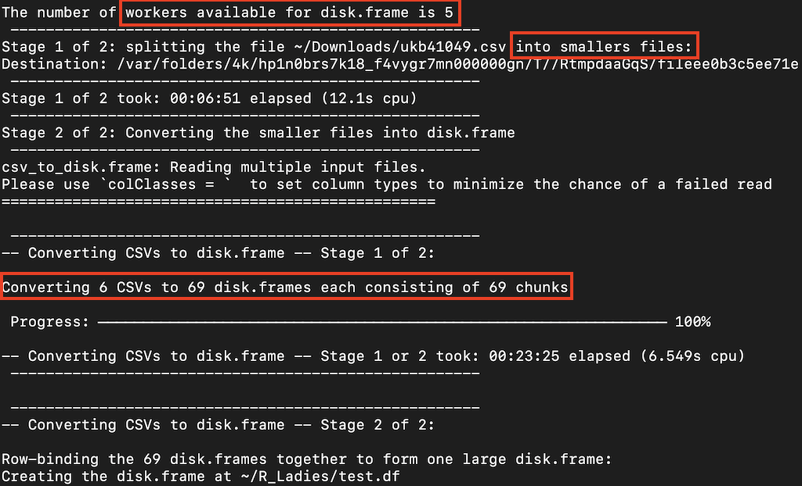

  
  
```{r setup, include=FALSE}
knitr::opts_chunk$set(
	eval = TRUE,
	warning = FALSE,
	message = FALSE,
	collapse = TRUE,
	comment = "###",
	include = TRUE)
```
  
***  
  
**How to handle large datasets?**   
Eg. a 7.5gb sized csv file with 40k+ obs and prob. 4k+ vars while only a subset of vars is needed.  

**Two solutions**  
   + Python (pandas/dask) + R (reticulate)  
   + R (disk.frame)  
   
***  
  
## First, `reticulate`!    
  
1. Install and load the package
```{r}
if(!require(reticulate)){
    install.packages("reticulate")
}
library(reticulate)
```

2. Check Python configuration  
Note, if not specifying pre-exisitng Python env, prompt to install a `miniconda`     
*r-reticulate* conda env will be created using `Python3.6` and `Numpy`  
`use_python()` *to specify which Python to use!*  
```{r}
py_config()
```

 
3. Let's check if `pandas` is available.
```{r}
conda_remove('r-reticulate', packages = 'pandas')
py_module_available(module = 'pandas')
```
  
4. Before installing `pandas`, let's check available conda envs.  
```{r}
conda_list()
```

5. install the package under the *r-reticulate* env  
```{r}
py_install(packages = "pandas", envname = "r-reticulate")
```

  Now, let's check again.
```{r}
py_module_available(module = 'pandas')
```


6. New envs can be created using `conda_create(envname = "xx", packages = "pandas")`  
  Then specify the use of the newly created env using `use_condaenv(condaenv = "xx")`  
  

7. Now let's run Python in R  
  First, let's import a csv file in Python.  
  Here we use [Beijing PM2.5 dataset](https://www.kaggle.com/djhavera/beijing-pm25-data-data-set).  

```{python}
import pandas as pd
filename="~/R_Ladies/BJ_PM25.csv"
pdat = pd.read_csv(filename, sep = ',')
pdat.head()
pdat.shape
```


8. Now, let's run the same code in R.  
  + There are a few options. First, we can run it in string.  
```{r}
py_run_string("import pandas as pd")
dt=py$pd$read_csv(py$filename, sep = ',')
head(dt)
dim(dt)
```


  + Alternatively, we can run a *.py* file.     
```{bash}
cat ~/R_Ladies/demo_chunk.py
```
  
  + Now, we run *.py* script in R and check the *py* object in R.

```{r}
source_python(file="~/R_Ladies/demo_chunk.py")
head(py$chunkdf)
```


  + Or, in interactive `REFL` (Python read-eval-print loop)  
  `file = py$filename`  
  `repl_python()`  
  `import pandas as pdd`  
  `refl_df = pdd.read_csv(r.file, sep  = ',')`  
  `refl_df.head()`  
  `exit`  
  
  
  
`options(reticulate.traceback=T)` *to print Python stack traces for errors*   
      
  
***
  
## Now, `disk.frame`!  
  - make use of [`fst`]((https://www.fstpackage.org/)) and [`data.table`](https://github.com/Rdatatable/data.table/wiki) packages  
  - process data larger than RAM but smaller than Disk
  - create a folder (disk.frame object) containings chunked files (in *.fst* format)   
  
  

 1. install and load the package  
```{r warning=FALSE}
if(!require(disk.frame)){
    install.packages('disk.frame')
}
library(disk.frame)
```
  
  
 2. configure the package setup to allow parallel processing.    
 By default, `setup_disk.frame()` uses all available CUP cores.  
```{r warning=FALSE}
setup_disk.frame(workers = 2)
``` 
 
 3. load the same BJ PM2.5 dataset.  
  + Note, directories (disk.frame object) must have *.df* extension  
```{r warning=FALSE}
otdir = '~/R_Ladies/tmp.df'
if(!dir.exists(otdir)){
  dir.create(otdir)  
}

disk.df = as.disk.frame(df = py$pdat, 
                        outdir = otdir,
                        overwrite = TRUE)
```
  + There should be a series of *.fst* files/chunks in the *.df* folder  
  Let's take a look.
```{r}
list.files(otdir, all.files = T)
```  
  + *.df* also contains a meta file  
```{bash}
cat ~/R_Ladies/tmp.df/.metadata/meta.json 
```
  
  + `in_chunk_size` *can be used to specify row numbers of each reading in case of large dataset *  
  "If `disk.frame` deems your CSV to be small enough to fit in RAM it will use data.table's `fread`. If the file is too large, it will use `bigreadr` to SPLIT the file into smaller files and then read the smaller files simultaneously. In practice this was found to be the fastest approach."  


```{r}
otdir = '~/R_Ladies/temp.df'
if(!dir.exists(otdir)){
  dir.create(otdir)  
}

disk2.df = csv_to_disk.frame(py$filename,
                            in_chunk_size = 10000,
                            outdir = otdir,
                            overwrite = TRUE,
                            backend = "data.table", #or 'readr'
                            chunk_reader = "bigreadr")

list.files(otdir) 
```  
  
   + File split for larger sized data as shown below   
{width=50%}
   
   
   + Now, let's subset data by column names, using `dyplr` functions
```{r}
 sub.df = disk.df %>%
   srckeep(c("year","pm2.5","TEMP")) 

 sub.df %>% head
```
   + *using `srckeep` only load selected cols into memory whereas `select` will load all cols before filtering*  
     
   + We can get summary descriptions by cols
```{r}
pm25.stats = disk.df %>% 
  group_by(TEMP) %>%
  summarise(avrPM2.5 = mean(pm2.5, na.rm = T),
            medPM2.5 = median(pm2.5, na.rm = T)) %>%
  collect #computation executed

pm25.stats
```
  
  
  

4. Add new data as a chunk to the existing disk frame.  
```{r}
add_chunk(disk2.df, dt) #dt: r data frame
nchunks(disk2.df)
list.files(otdir)
```
  
5. Apply functions to all chunks using *cmap*.  
  + Remember to specify `lazy=F` or to use `collect` for actual computation.  
```{r}
result = disk2.df %>% 
  cmap(function(chk) {
    chk[1, ] #showing the first row of each chunk
  }, lazy=FALSE) 

result
```  

6. Save intermediate data as a new *.df*     
```{r}
otdir = '~/R_Ladies/selected.df'
if(!dir.exists(otdir)){
  dir.create(otdir)  
}

disk.df %>%
  srckeep(c("year","pm2.5","TEMP")) %>%
  write_disk.frame(outdir = otdir, overwrite = TRUE)

list.dirs('~/R_Ladies')
```
  


7. **More information about `disk.frame` can be found [here](https://diskframe.com)**  
